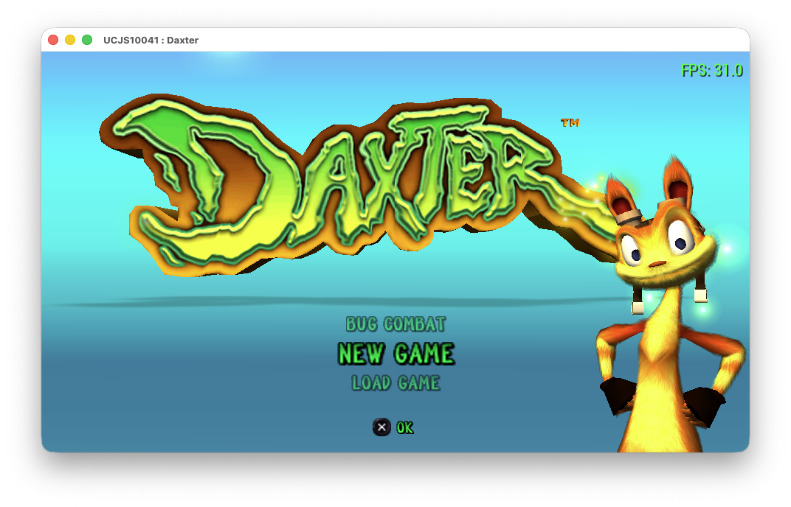
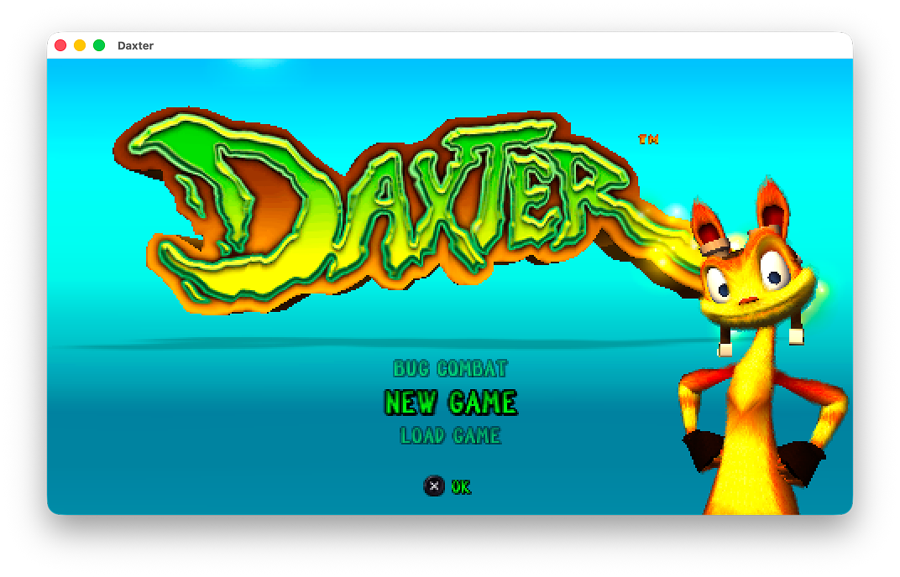

# psprism 💎

> Static recompilation engine for PlayStation Portable executables.  
> Translates Allegrex MIPS binaries into clean, portable C++20 code.

---

## 🚀 Overview

**psprism** converts PlayStation Portable executables (ISOs, ELFs, or PRXs) into readable, self-contained C++20 projects.

Rather than interpreting instructions at runtime like a traditional emulator, `psprism` statically recompiles MIPS Allegrex machine code, VFPU vector operations, relocations, and imports ahead of time. The resulting C++20 project can run through the native `refract` compatibility layer or be rebuilt as a hybrid PSP executable for validation on PPSSPP and real hardware.

---

## 🔄 Verification: PSP ➔ C++ ➔ PSP

Before targeting native host operating systems, generated code is validated directly on original PSP hardware:

```text
       PSP ISO / ELF / PRX
                │
                ▼
      ┌──────────────────┐
      │     psprism      │
      └──────────────────┘
                │
                ▼
       Portable C++20 Code
                │
        ┌───────┴───────┐
        ▼               ▼
 ┌─────────────┐ ┌─────────────┐
 │ PSPSDK Build│ │ Host Runtime│
 │ (Real PSP)  │ │ Translation │
 └─────────────┘ └─────────────┘
```

The PSP backend normally compiles the complete generated C++ dispatcher and
all translated functions into a new PRX. An explicit code-map `overlay`
selection enables the optional hybrid model: selected generated functions are
installed through ABI-, GP-, FPU-, and VFPU-safe trampolines while unselected
functions remain Allegrex code.

`make psp` and `make psp-run` always use an actual recompiled path.
Fixed-address executables and relocatable PRXs are replaced by the full
generated C++ PRX by default. Code-map `overlay` entries explicitly opt into a
hybrid build for selected functions; original-only PSP packaging is never used
by these targets. PSP generated code is compiled with `-O2`.

An automated PSP roundtrip test modifies a generated function, rebuilds the PRX and verifies that the changed result is observable. This exercises translation, relocation, mixed original/generated calls and the overlay ABI instead of merely repackaging the original executable.

---

## 🎮 Current Status & Compatibility

> [!NOTE]
> **Work in Progress:** `psprism` is an active open-source project working to revive PSP games and bring them to modern operating systems and other platforms including older devices where PSP emulators like PPSSPP cannot run.

Compatibility is no longer limited to a single startup path. Current manual validation covers a complete playthrough on real PSP hardware and several games from different engines running natively on macOS:

| Title | PSP Output | Native macOS (`refract`) |
|---|:---:|:---:|
| **Daxter** *(Ready at Dawn)* | ✅ **Fully Playable** — 100% completion verified on real hardware | ✅ In-game |
| **LEGO Batman: The Videogame** | ⚪ Not yet publicly validated | ✅ In-game, combat and audio |
| **Tetris** *(EA)* | ⚪ Not yet publicly validated | ✅ Playable with graphics, input and audio |
| **God of War: Chains of Olympus** | ⚪ Not yet publicly validated | 🟡 Startup and menu flow |

* 🕹️ **Hardware Roundtrip:** Daxter executes from start to finish in the rebuilt PSP package with graphics, audio, game logic and VFPU behavior intact. Generated overlay changes are covered independently by the automated PSP roundtrip test.
* 🖥️ **Host Translation Layer:** `refract` now reaches interactive gameplay in multiple titles from different engines. The compatibility work is implemented in shared PSP subsystems rather than title- or address-specific patches.
* 🧪 **Validation scope:** The table records observed milestones, not a claim that every scene or subsystem is complete. Results can still vary by title, region and execution path while development continues.

| PPSSPP Reference | Native macOS (`psprism` + `refract`) |
|:---:|:---:|
|  |  |

---

## 🧩 Subsystem & SCE Module Support

For native execution on host platforms, `psprism` implements native host bridges for Sony `sce` kernel and firmware modules:

| Subsystem / Module | Description | Status | Implementation Details |
|---|---|:---:|---|
| `sceDisplay` | Display & VBlank | ✅ | Framebuffer presentation, refresh timing, frame counters |
| `sceCtrl` | Controller & Input | ✅ | Native gamepads, analog stick input, keyboard fallback |
| `sceGe` | Graphics Engine | 🟡 | Scheduled display lists, replay traces, complete PSP texture/CLUT formats, depth targets, blending and color tests |
| `sceKernel` | Threading & Sync | 🟡 | Threads, guest stacks, semaphores, event flags, memory pools |
| `sceIo` | Filesystem & I/O | 🟡 | Disc ISO reading, virtual MemoryStick paths, sync/async operations |
| `sceUtility` | OS Utilities | 🟡 | On-screen keyboard (OSK), message dialogs, savedata UI |
| `sceUmd` | UMD Drive | 🟡 | Disc state detection, drive events, media checks |
| `sceRtc` | Real-Time Clock | 🟡 | Microsecond tick conversion, system timers |
| `scePower` / `sceImpose` | System State | 🟡 | Battery state, volume settings, regional configuration stubs |
| `sceAudio` / `sceSas` / `sceAtrac` | Audio Subsystem | 🟡 | Central native mixer, queued blocking output, VAG/PCM SAS mixing with ADSR, and sample-accurate streamed ATRAC3/ATRAC3+ decoding; advanced effects remain incomplete |
| `sceMpeg` | Video / PMF Pipeline | 🟡 | PSMF/PES demux, ringbuffers, FFmpeg-backed H.264 decode, ATRAC3+ audio and PSP framebuffer conversion; seeking and per-title edge cases remain incomplete |

---

## 🛠️ Quickstart

### 1. Build psprism
```bash
git clone https://github.com/anthonyhfm/psprism.git
cd psprism

make -j
make test
```

### 2. Recompile a PSP Executable
```bash
./build/bin/psprism game.iso
```
The interactive wizard parses executable relocations, extracts disc assets, and generates a standalone C++ project.

Game functions can be replaced directly from recovered Ghidra prototypes,
original translated functions can be called safely, and reverse-engineered
globals can be read or overwritten through the generated project's patch
framework. See [Game-function patching](docs/game-patching.md).

### 3. Build the Generated Project
```bash
cd game_recompiled

# Build for PSP Hardware / PPSSPP
make psp

# Build or run the native macOS app
make macos
make macos-run
```

Native PMF cutscenes use the system FFmpeg libraries (`avcodec`, `avformat`,
`avutil` and `swscale`). On macOS, install them before configuring a generated
project:

```bash
brew install ffmpeg
```

Set `-DREFRACT_USE_FFMPEG=OFF` only for a build that intentionally omits native
H.264 cutscene decoding.

---

## ⚡ Key Features

* 🧬 **Allegrex MIPS & VFPU Lifting:** Translates integer, FPU, and vector operations into standard C++20.
* 📦 **Self-Contained Output:** Generated C++ projects build independently without requiring `psprism` source trees.
* 🗺️ **Ghidra Map Integration:** Imports function symbol boundaries and names for readable code structure.
* 🧷 **Hybrid PSP Overlays:** Keeps unchanged Allegrex functions native while compiling edited generated functions back into the PSP build.
* 🎯 **Hardware Roundtrip Verification:** Exercises generated changes through automated PSP tests and real-hardware gameplay validation.

---

## 🤖 AI Acknowledgment & Transparency

A significant portion of the `psprism` codebase and translation runtime was built with the assistance of AI technology, developed under close human guidance, architectural review, and testing.

This project uses AI as a force multiplier for software preservation—accelerating complex MIPS/VFPU instruction lifting, subsystem stubbing, and host translation layers that would otherwise require thousands of hours of manual labor. Every component is audited and verified against real PSP hardware to ensure correctness, stability, and open-source longevity.
